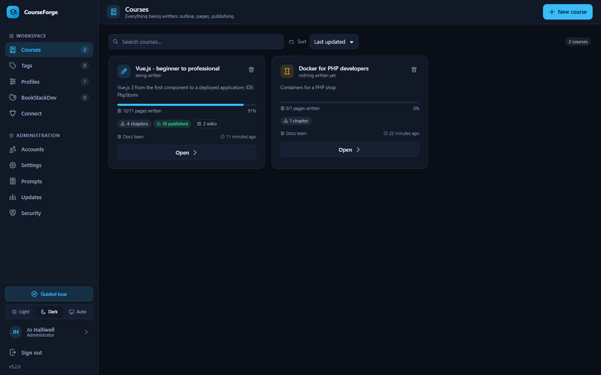
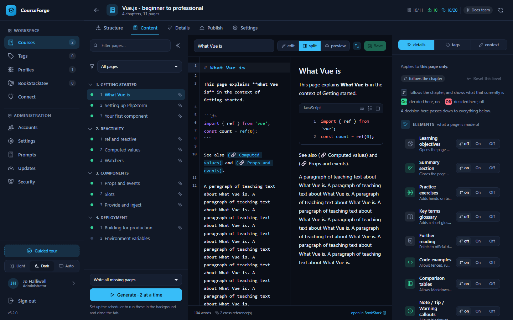
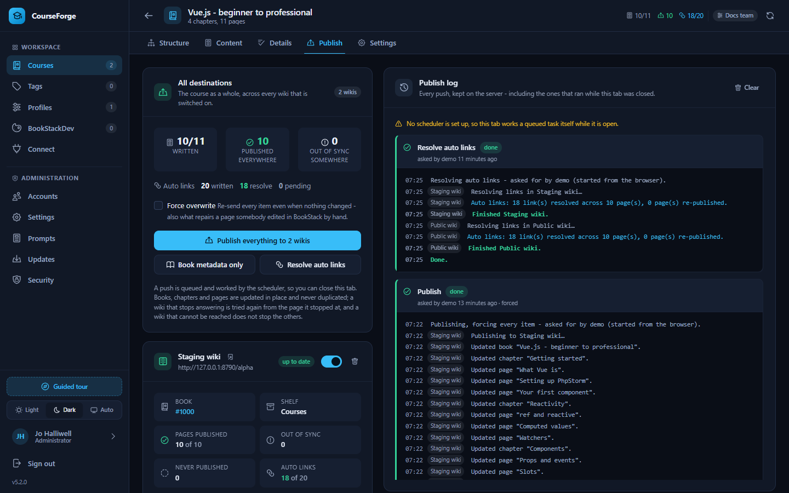
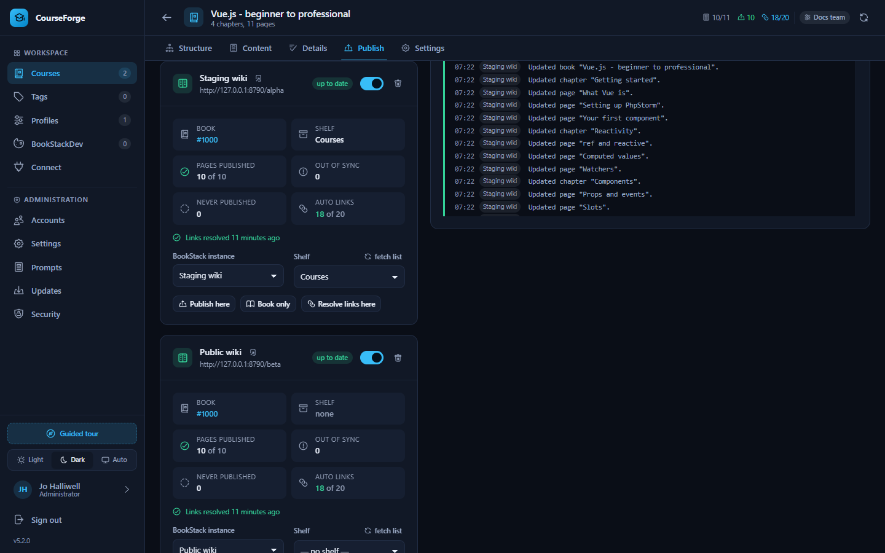
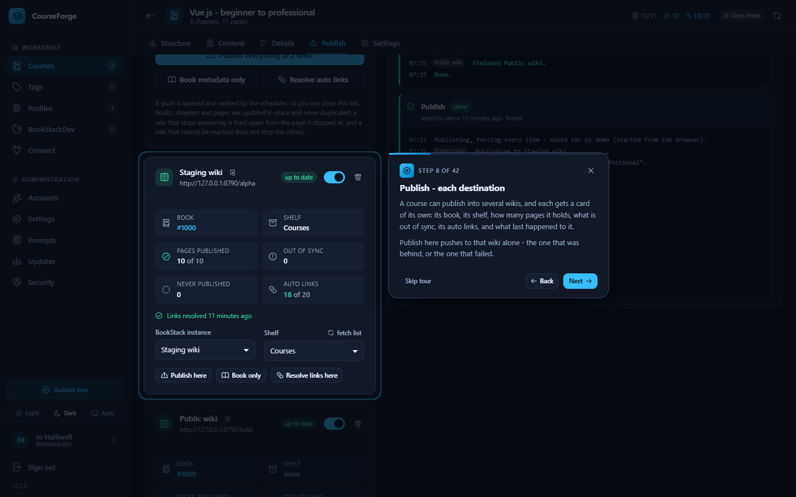
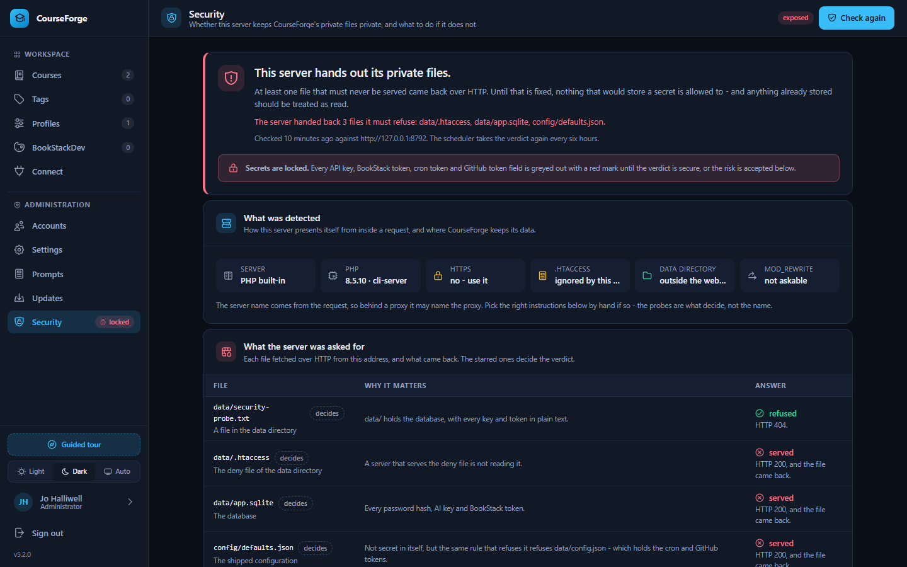
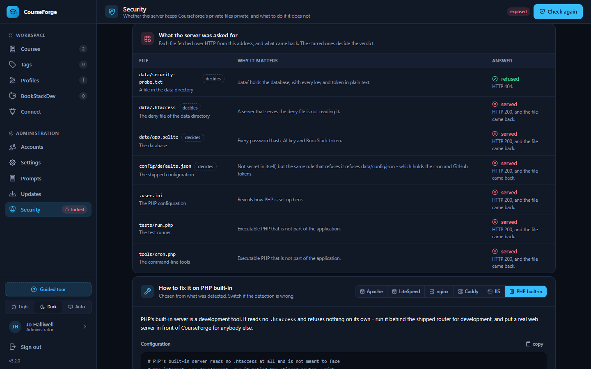
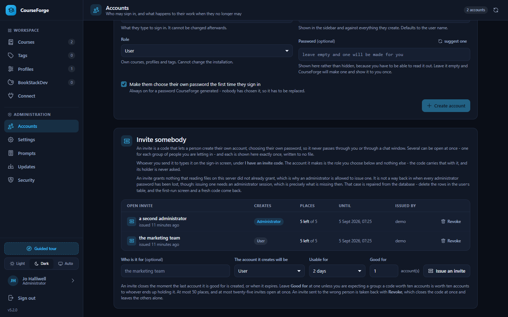
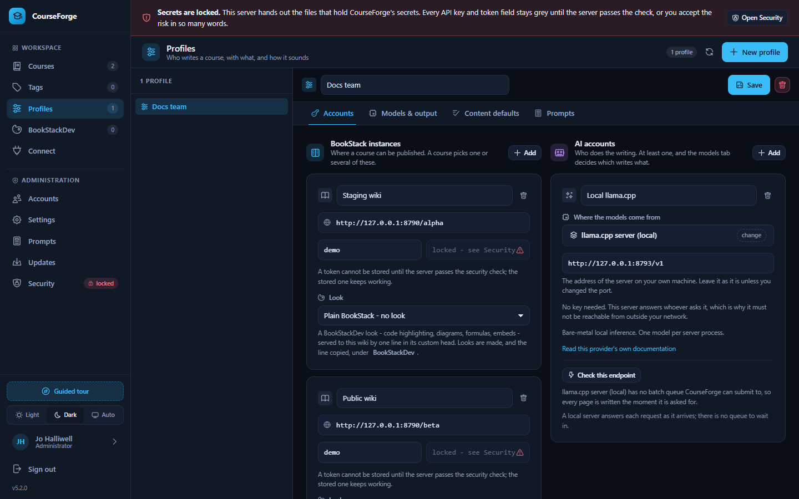
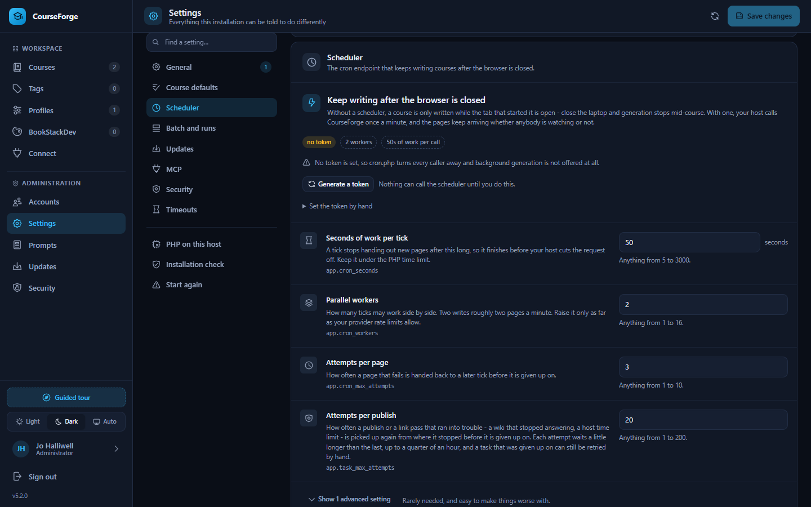

# CourseForge 5

A self-hosted tool that turns a one-line brief into a complete course — outline,
chapters, written pages, flashcards — and publishes it into a
[BookStack](https://www.bookstackapp.com/) knowledge base.

```
"Vue.js – complete course from beginner to professional; IDE: PhpStorm"
        │
        ├─ AI designs the outline        20 chapters, 140 pages
        ├─ AI writes each page           in the background, or at half price in a batch queue
        ├─ you steer what goes in        per course, chapter or page
        └─ CourseForge publishes it      into BookStack — one wiki or several, links and all
```

You can do all of that in a browser, or you can do all of it from an AI client —
Claude Code, the Claude desktop app, OpenAI Codex, Cursor, VS Code or Gemini CLI.

## What it is made of

No build step, no package manager, no framework runtime to compile at load time.
Copy the directory to a PHP host and it runs.

| Layer      | Choice                                                              |
|------------|---------------------------------------------------------------------|
| Frontend   | Vue 3 as native ES modules through an import map, hand-written CSS  |
| Editor     | CodeMirror 6; Shiki, Mermaid and MathJax in the preview             |
| Backend    | PHP 8.1+, no Composer, one front controller                         |
| Storage    | SQLite, migrated automatically                                      |
| AI         | Anthropic, OpenAI, Google Gemini, OpenRouter, twenty-odd gateways, or a local model |
| Bulk runs  | In the background from cron, or a provider batch queue at half price |
| Publishing | The BookStack REST API                                              |
| Automation | A Model Context Protocol server with the whole application on it    |

## Getting started

```bash
# 1. copy the directory to your web root
# 2. make data/ writable by PHP
# 3. open it in a browser
```

There is no configuration file to edit before the first start. CourseForge
writes `INVITE-CODE.txt` next to `index.html`, the setup screen asks for the code
in it, and the account it creates is the first administrator. Everything after
that — the AI accounts, the scheduler, the security policy, the whole prompt
library — is set from inside the application.

```bash
php tools/diagnose.php     # checks the installation, if you have a shell
```

Then: create a **Profile** (an AI account, one or more BookStack instances,
models, language), create a **Course**, generate the **Structure**, write the
**Content**, and **Publish** — into one BookStack, or into several at once.

Full documentation, including the nginx configuration and the technical
background, is in [docs.md](docs.md).

## A look around

Every screen below is the application as it ships, in the dark theme it opens
with (there is a light one, and an automatic one that follows the system).



**Courses** is everything being written on the installation: how far each has
got, which profile writes it, how many wikis it publishes to. A course starts as
one line - *"Vue.js, beginner to professional; IDE: PhpStorm"* - and the AI
designs the outline from it.



**Content** is where the pages are written: by hand in the Markdown editor, one
at a time while you watch, or in a background run that carries on after the
laptop is shut. The preview renders code, diagrams and formulas exactly as
BookStack will, and the two halves scroll together.



**Publish** sends the book to BookStack - one wiki or several. Since 5.2 a push
is a task the scheduler works, so you can close the tab; a wiki that stops
answering half way is picked up again from the page it stopped at, and the log
of every push is kept on the server. Each destination has a card of its own.



Per wiki: the book, the shelf, how many pages it holds, what is out of sync,
what has never been pushed, how its cross references resolve, and what last
happened to it - with **Publish here** for that wiki alone.



The **guided tour** starts by itself the first time an account signs in and
walks through every screen and every setting - forty-odd steps for an
administrator, fewer for a user - lighting up each section as it explains it.
Open it again any time from the button above the theme switch.



**Security** asks the server for CourseForge's own private files over HTTP and
reports which came back. On nginx, Caddy, IIS or a misconfigured Apache the
`.htaccess` files that protect the data directory are ignored, and the verdict
says so - with the configuration block to paste for the server it detected.
Until the verdict is *secure*, every API key and token field is locked.





**Accounts** is who may sign in. Several invites can be open at once, each with
a label, a role, an expiry and a number of places - one for the marketing team,
one for a contractor, one for a colleague who should be an administrator.



**Profiles** bundle the AI accounts, the BookStack instances, the models, the
language, the content defaults and the prompt wording a course is written with.
The key fields are greyed out with a red mark until the server has passed the
security check - a secret must not be written into a database anybody can
download.



**Settings** holds everything the installation can be told to do differently,
one card per group. The scheduler card is the one that matters most: your host
calls `cron.php` once a minute, and from then on runs and publishing carry on
with the browser closed.

## What is new in 5.2

**Publishing is a task, not a request.** Pressing Publish writes a task down
and returns; the scheduler works it in slices of one tick each, and the tab can
be closed. A push interrupted half way - a wiki that stopped answering, a host
time limit, a process that died - is picked up again from the page it stopped
at, never from the start, with a growing pause between attempts and a ceiling
you can set. One wiki failing does not stop the others, and only the failed one
is tried again. On an installation with no scheduler the browser works a queued
task itself, one bounded slice per request, and says so.

**The publish log lives on the server.** Every line a task says is written down
as it is said, with the wiki it belongs to, and shown whenever the tab is
opened - including the pushes that ran while nobody was looking. Stop and Retry
are yours; Retry carries on from where the task got to.

**Each destination has its own card.** The book, the shelf, pages published,
out of sync, never published, how the cross references resolve, and the last
outcome - per wiki, beside a card that speaks for all of them. *Publish here*,
*Book only* and *Resolve links here* act on one wiki.

**Several invites at once.** An invite carries a label - who it is for - and
any number may be open together. A code issued from the app is shown exactly
once and written to no file; only the first-run invite still goes into
`INVITE-CODE.txt`. Revoke one and the others stand.

**A guided tour.** It starts by itself the first time an account signs in and
walks through every screen and every setting, spotlighting each section as it
explains it. An administrator and a user get different tours. Cancel it at any
time; open it again from the button above the theme switch.

**Administration › Security.** CourseForge asks the server for its own private
files over HTTP and reports which came back - the data directory, the
database, the deny file, the configuration. Until every one is refused, every
field that would store a secret is locked and carries a red mark that leads to
the screen; the screen names the server it detected and gives the configuration
block for it, and the one arrangement that is safe everywhere. An administrator
who has verified the server by hand can accept the risk by typing a code shown
on the screen, which is recorded with their name.

**A security review, applied.** Addresses a profile carries are vetted before
they are called and never have their answers quoted back; the shared cURL
wrapper speaks HTTP only; a blank secret is carried forward only for the address
it was stored against; `Host` is used only when it looks like a host and
`X-Forwarded-Host` never; sessions use strict mode and are renewed on a password
change; password changes are throttled like sign-ins, in the browser and over
MCP; an account lock no longer shuts out the address the owner signs in from;
request bodies are capped; connection tokens minted over MCP die with the
connection that minted them and never carry a scope the account lacks; the MCP
origin check measures against the configured address; tool results are cut at
the size the tool declared; a look may load its libraries only from the module
CDNs or the installation itself; the BookStackDev endpoint varies its cache on
the header that decided, answers preflights only for allowed origins, and no
longer names the look in a refusal; embeds run sandboxed; the deny lists gained
`.git`, `.github` and `.tmp`; and a content security policy is sent.

Upgrading from 5.1 is a normal update: the database gains two tables and three
columns on first start. The first sign-in afterwards starts the tour once, and
the key fields stay locked until Administration › Security has been opened - the
check runs there by itself.

## What is new in 5.1

**BookStackDev lives in CourseForge.** The BookStack enhancements — Shiki code
highlighting in every language it ships, Mermaid diagrams, MathJax formulas,
link embeds, an audio player, external-link marks, a light/dark toggle, page
styling — are configured on a new **BookStackDev** screen as *looks*: every
value a card, every feature a switch, defaults exactly as the standalone script
ships them. A look gives you one line for BookStack's custom head, served by
`bs.php`, and that line works only on the wikis the look allows: the instances
in your profiles that wear it, plus any origin you add by hand. One look serves
any number of wikis. A conventions check compares each look with the prompts of
the profiles using it and offers the wording that keeps them in agreement — on
the look, in the profile's prompts and in the administration prompts.

**The Structure tab is a split view.** The outline is edited in the Markdown
editor with its markers highlighted, and beside it is what Apply would make of
it, parsed as you type: chapters, pages, what is new, moved or removed. The
halves scroll together. The AI moved to a panel on the right, so the outline
has the width.

**Defaults you can start with.** New courses ask for 3,000 to 15,000 words a
page, five Anki cards and as many searches as the model sees fit; the Anthropic
output ceiling is 32,000 tokens so a long page is not cut short. The time-zone
setting is a fuzzy search over the whole list, and the Settings screen itself
has a search box.

**The Claude subscription provider is retired.** CourseForge runs on ordinary
web servers, which cannot hold a desktop sign-in. An account of that kind is
kept and shown as retired so nothing referring to it breaks; give the profile
an API account to write with.

**Libraries current.** Shiki 4, highlight.js 11, Mermaid 11, MathJax 4 and
Font Awesome 7 on the wiki side, and an unlabelled code block is recognised by
CourseForge's own detector before highlight.js is asked — which stops six lines
of Python being coloured as a DNS zone file.

Upgrading from 5.0 is a normal update: the database gains one table on first
start, and nothing else changes shape.

## What is new in 5.0

A release about the interface: what it looks like, how it is organised, and
whether it can be used without a mouse. No pipeline changes and no schema
change - but a profile can now decide what every course written with it
starts from, which is the one new thing under the surface.

### An interface that can be read before it is read

Every screen, every card, every setting and every tab now carries a glyph
from the Nucleo icon set, drawn to one grid and one stroke, so a list is
skimmed by its pictures before a single label is read. A hundred icons, each
named in `assets/js/components/AppIcon.js` by the Nucleo id it came from,
inlined as SVG that takes the text colour around it - no font, no CDN, no
flash of missing glyphs.

The sidebar is divided into **Workspace** and **Administration**, each
destination has a hint, and the account entry at the foot shows who is signed
in, as an avatar, a name and a role. The theme control has three positions -
light, dark and **Auto**, which follows the system and keeps following it -
instead of a toggle that took the choice away. Every screen opens with a line
saying what it is for.

**Settings** gained an index down its side that follows the scroll, marks the
group on screen, and counts what this installation has changed in each - so an
inherited installation can be surveyed without reading a single row. Every
setting has a glyph that says what kind of thing it is, and every switch is a
switch rather than a checkbox that had to be read to be understood.

**Courses** cards carry a tile that says where each course stands - being
written, written but not published, published, a run open, a page failed -
and an empty course list explains the whole application in five steps. The
course header says how big the course is; the Details tab says what its
"inherit" position points at, and can take you there.

### Course defaults look like the Details tab, because they are the same list

The fourteen elements and eight values a course can decide were drawn on the
Settings screen as a plain list of settings rows - a checkbox called "Learning
objectives" with no glyph, a number box called "Minimum length" - that looked
nothing like the Details tab the same fourteen elements are switched on a
course with. They are now drawn as that tab draws them: the same rows, the same
tiles, the same order, the same words. What differs is the control, and it
differs for a reason: every other level has three answers - on, off, or follow
the level above - and this level has nothing above it, so its switch has two.

### A profile decides what every course on it starts from

Until now the only way to give twenty courses the same house style -
objectives on, 1,500 words, a standing audience of working developers - was
twenty Details tabs. The profile is what those courses already share, so it is
where a default belongs. A profile has a fourth tab, **Content defaults**, with
the same editor as a course, one level up; the chain is now

```
installation  →  profile  →  course  →  chapter  →  page
```

and the value that wins is the one closest to the page. Only deviations are
stored at every level, so a course that never disagreed with its profile
follows it when it changes, a profile that never disagreed with the
installation follows that, and a course whose profile is deleted goes back to
the installation. A course's Details tab says which of the two its "inherit"
position points at, and one button opens the profile on the right tab.

Over MCP the same thing is `set_profile_details`: features as 1, -1 or 0,
values as numbers or text, `reset_all` to drop what the profile decided, and
the crossed-lengths refusal every other door to that pair has. `get_profile`
reports the decisions, and `get_details` on a course names the profile as
where an inherited answer comes from.

### Usable without a mouse, and readable without sight

Every icon-only button has a name. Every tab bar is a tab list, every
segmented control a radio group, every switch a switch, and the current
navigation entry says so. Progress bars carry their numbers. A skip link
takes the keyboard past the navigation to the page. Error strips are
announced. A decorative icon is hidden from assistive technology; one that
stands for something on its own is named.

### Upgrading

Nothing to do, and no schema change. A profile gains its content-defaults
layer the first time it is saved, and an empty layer means exactly what no
layer meant: whatever the installation says.

383 tests pass, 4 of them new in `tests/profile-defaults.test.php`. Every
Vue template was compiled with the shipped Vue before release, and every
screen was driven in a browser against a scratch installation - dark and
light, desktop and phone width.

## What was new in 4.10

Eleven readers went over the whole application with one instruction — find
what is actually wrong, not what could be tidier — and this release is what
they found. Twenty-odd fixes and no features; the ones worth knowing about are
below, in the order of the damage they did.

### Stopping a batch threw away the pages it had already written

"Stop this run" on a batch asked the provider to cancel and then closed the run
on the spot: every page still waiting was released, and the run was over. But a
cancel is asynchronous everywhere, and a batch keeps whatever it answered before
the request landed — pages that were paid for. Nothing could download them while
the batch was still winding down, and nothing ever tried afterwards, because a
closed run is never polled. So the button reliably discarded finished work, and
on OpenRouter — which has no cancel route at all — it closed the run while the
batch ran on, billing, with nobody left to collect it.

The run now stays open until the provider has said its last word. The next check
collects the pages that were finished, releases only the ones that never ran,
and closes the run then. A provider that cannot be stopped says so, and its run
stays open for the same reason.

### A book created twice, once per retry

A course's first publish created its book, attached it to the shelf, and then
wrote the book's id down. A shelf that had been deleted, or a token not allowed
to edit shelves, failed the middle step — and the id was thrown away with the
exception. The next push found no book on record, created another, and failed
the same way: one orphaned book per attempt until somebody fixed the shelf and
deleted the extras by hand. The id is now written down the moment the book
exists.

### A setting saved, and lost to a page load

Reading `data/config.json` rewrote it, on every request, whenever the file held
a `prompts` key at its top level — which is not only a 3.x document but any
installation that has overridden a single prompt. The rewrite took no lock. A
request that read the file just before an administrator saved a setting wrote
its stale copy back just after: HTTP 200 for the save, and the setting gone.
Reading no longer writes anything, and the one-time reduction of a 3.x document
happens under the same lock as every other write.

### Deleting a profile stranded the batch running under it

The Profiles screen deleted a profile without looking. The next poll of a run
submitted under it found no credentials, wrote the run off as failed, and
stopped asking — while the batch went on running at the provider with nobody
left to collect it. A profile with an open run under it is now refused, on both
surfaces, with the count.

### The course editor was the one screen that never asked

Every other screen asks "Leave without saving?" before it throws unsaved work
away. The course editor did not: a page edited and not saved, an outline edited
and not applied, a destinations list not saved — one click on the sidebar or
the back arrow, and it was gone. All five tabs now ask, and the back arrow asks
the way the sidebar does. Two more things in the same tab: **Rewrite
everything** now asks before it starts from the two primary buttons, as it
always did from the third, and an edit to the outline is no longer discarded
when a title is renamed on the Content tab.

### Smaller, and still real

- `create_course` over MCP let an administrator create a course under their own
  name pointing at somebody else's profile — a course that then failed "Profile
  not found" on every call after. It is refused, as the browser refuses it.
- `update_profile` ignored `preset_key`, the per-kind extras and
  `bookstack_name` when adding a profile's *first* account or instance — which
  is every profile made in the browser. A Groq account asked for that way was
  stored as "custom" with an empty endpoint, and no error.
- `gpt-5-chat-latest` was taken for a reasoning model and had its temperature
  stripped before the first request went out.
- The Claude subscription account passed the model id to the command line
  unchecked. A model id is letters, digits and a few separators; anything else
  is refused before it goes anywhere near a shell.
- The word count for Chinese and Japanese counted a whole sentence as one word.
  Each character counts, as every word processor counts them.
- A four-backtick fence quoting a three-backtick example inside it was closed
  at the example, and the rest of the block was set as prose.
- A placeholder inside a *value* — a page about Vue templates quoting its own
  `{{tags}}` back for a rewrite — had the real tag list written into it before
  the model saw it.
- A course update refused for its shelf had already renamed the course.
- Publishing one page or one chapter from the Content tab reported success when
  one of several wikis had failed.
- Creating a second account with a generated password, or a second connection,
  replaced the card holding the first password or token — the only copy there
  was. Both wait now until the card has been acknowledged.
- Mermaid and MathJax, once they failed to load for any reason but the network,
  stayed failed until the page was reloaded. The editor's language modes had the
  same memory.
- A batch the provider accepted but the database could not record is withdrawn
  from the provider rather than left running under an id nothing knows.
- `tools/deploy.php --full --prune` pruned nothing; the development router could
  be walked past with `/x/../`; two workers adding the same column after an
  upgrade no longer answer one of them with a 500.

Nothing to do when upgrading, and no schema change.

## What was new in 4.9

### Two page counts disagreed, and the wrong one was believed

`list_pages` reported seven finished pages of a course as 194, 283 and 954 words
long. They were 3,893, 4,677 and more. Nothing was lost — the count was wrong,
and it was wrong in the direction that gets work destroyed: a model reading that
list sees pages that look like failed generations and rewrites them, spending
money to replace text that was already there.

The count ran the Markdown through `strip_tags` first. Markdown is not HTML:
`List<String>`, `Map<String, Object>` and a written-out `<div class="card">` are
prose *about* code, and `strip_tags` removes each of them along with everything
up to the next `>`. Worse, a single `a<b` with no later `>` anywhere on the page
is an unterminated tag, so the rest of the document is discarded — a 2,408-word
page came back as two words.

It now counts the page as it is stored, which is what `get_page` and the browser
have always counted. Three surfaces answering "how long is this page" differently
is worse than any one of them being wrong, because the difference reads as
information.

### Everything the browser can do, a connected client can do

That was the claim. It was audited screen by screen against the tool registry,
and it was untrue in eighteen places, so this release closes them. Thirteen new
tools, and arguments added to five that existed.

The one that prompted it: a profile could be given its **first** BookStack
instance and never a second, because `update_profile` names *the* instance of a
profile that has one. 4.7 made publishing a course into several wikis at once a
headline feature, and a client setting an installation up over MCP could
configure exactly one of them. `add_bookstack_instance`,
`delete_bookstack_instance`, `add_ai_account` and `delete_ai_account` are the
Add and Remove buttons the browser has always had beside those two lists.

Also new:

- **`preset_key`** on `create_profile`, `add_ai_account` and `update_profile`.
  The browser's provider picker offers two dozen rows — Groq, Together,
  Fireworks, DeepSeek, a local llama.cpp — and most are the same
  OpenAI-compatible driver at a different endpoint. The tools took only the six
  raw driver kinds underneath them. So did `organization`, `cli_path`,
  `site_url` and `site_name`, the fields only some kinds use.
- **`set_model_slot`**, which sets one slot alone — its account, its model, its
  temperature, its token ceiling. `update_profile` writes both together, which
  is right for a profile with one account and wrong the moment it has two.
- **`set_profile_prompts`** and **`list_prompt_slots`**: a profile's prompt
  overrides were readable and not writable, and the library naming them needed
  an administrator to read. Overriding a slot for one profile is not the same
  power as rewriting it for everybody.
- **`revoke_invite`**, because an invite could be issued and not withdrawn.
- **`get_cron_url`**, because the scheduler URL could only be read by rotating
  the secret in it first — which stops every scheduler already using it.
- **`list_detail_overrides`**, which answers "what does this course override,
  anywhere" in one call instead of one call per page.
- **`publish_course` with `part: "book"`**, for a renamed course that needs its
  book updated and not its five hundred pages.
- **`generate_page` with `extra_context`**, which the browser writes in the same
  click that generates.
- **`create_my_connection`**, **`rename_my_connection`** and **`list_scopes`**.
  A connection may not issue a wider one than itself: the request is checked
  against the groups the calling connection holds, an omitted scope list means
  "the same as mine" rather than "everything the account allows", and asking for
  a group this connection lacks is refused by name rather than quietly narrowed.
  A token can copy itself or make something smaller, never something larger.
  `update_profile` also finally takes `typography`, `ai_name` and
  `bookstack_name`.

Three things the browser does have no MCP equal and never will: signing in,
redeeming an invite and first-run setup all create or resume the very credential
a tool call needs before it can happen.

## What was new in 4.8

### The punctuation pass reads a quotation mark the way a reader does

4.6 taught CourseForge to set a generated page's punctuation the way its
language sets it. It read each mark by position — a mark after a space opens, a
mark after a word closes — and position turned out not to be enough twice over.
`**"Wort"**` came out as `**"Wort“**`, because a Markdown asterisk stood where a
space should have been and the opening rule declined the mark on its account.
And correct French came out *wrong*: in `« bonjour » et`, the closing guillemet
has a space on both sides, exactly like an opening one, so every `»` was turned
back into a `«` — on text that had been right before the pass ran.

The mark is now decided by three signals in order. **Position** first, with
Markdown emphasis stepped over on the way to it, so a quotation with asterisks
around it is still a quotation. **Nesting depth** second, which is what tells a
closing guillemet from an opening one when both of its neighbours are spaces.
**The glyph** last, for a mark that only ever points one way. And what gets
written is not what was read: a closing mark takes the pair *its own opening
mark* took, which is why `„Wort"` comes out as a pair at all, and why a double
quotation inside a double quotation comes out as `„… ‚…‘ …“` whichever character
the model typed. The depth is forgotten at every blank line, heading, list item
and table row, so one unbalanced mark costs its own paragraph instead of every
paragraph after it.

The rest of the pass grew with it, and all of it is code rather than a prompt —
nothing here calls a model, and none of it costs anything:

- an em dash between two words becomes a spaced en dash in the languages that
  set one that way, which is the single most reliable thing an AI writing German
  reproduces from English;
- `1990-2000` becomes a span, while `2026-09-01` and `T-34` are left alone;
- `5"` after a digit with no quotation open is a measurement and becomes `5″`,
  while the `"` closing `"42"` stays a quotation mark;
- `don't`, `'90s`, `rock 'n' roll` and `dogs' bowls` each get the apostrophe
  they want, and none of them is mistaken for a quotation;
- four spaces become one, a space before a comma goes, `( innen )` closes on its
  content, three blank lines become one, and trailing whitespace goes — except
  the two spaces that are a line break in Markdown;
- HTML comments and characters escaped on purpose join fenced blocks, inline
  spans, links, addresses, tags, formulas and table alignment rows as things
  that are lifted out and put back untouched;
- and Polish, Czech, Slovak, Hungarian, Russian, Ukrainian, Greek, Swedish and
  Finnish now get their own marks rather than English ones.

### …and it can be pointed at a course that is already written

All of that runs when a page is stored, which was no help to the pages stored
before it existed, stored with the setting off, or stored by 4.6 and 4.7.

**Course → Settings → Punctuation** now runs the same rules over a course that
is already finished. One chapter and its pages have their own button beside
**Publish chapter**; one page has one in the inspector. It asks first: the button
runs the whole pass with the writing switched off and says how much would change
— “of 41 pages and 6 chapters, this would change 12 pages and 1 chapter” — and
only then offers to go through with it. The number in the dialog is the number
that changes, because it comes from the same run.

It runs whether or not the profile corrects new pages, which is the point: that
setting answers “correct the pages I am about to generate”, and this button is
somebody standing in front of a course they already have. It touches every
page's Markdown and title, every chapter's title and description, and the book
title and description, and it rewrites the outline from the titles afterwards. A
page that needed nothing is not written at all, so nothing goes newly out of sync
with a wiki over a change that never happened.

Over MCP: `fix_typography`, with `course_id`, an optional `chapter_id` or
`page_id`, an optional `language`, and `preview`.

## What was new in 4.7

### A course can be published into more than one BookStack

A course used to have one destination. Choosing a second one meant a second
course: the same outline, the same brief, the same pages generated and paid for
twice, and two things to keep in step by hand for the rest of their lives.

**Course → Publish → Destinations** is now a list. Add as many BookStack
instances as the course's profile defines — a staging wiki and a live one, the
wikis of two departments, a customer's install and your own — each with its own
shelf. **Publish everything** goes to all of them; each one also has a button of
its own, for the wiki that was behind. A destination has a switch: off keeps
everything already published there on record and leaves it out of the next push,
which is the difference between pausing a destination and removing one.

Each destination holds its own book, and that is not a detail: the books have
different ids and different slugs, and a page's cross references point *inside*
the wiki it is in, so the same page is written slightly differently into each. A
push knows what it last sent to each wiki separately, so the wiki that was
already current is skipped there and rewritten here, and nothing is ever
duplicated anywhere. A wiki that is down does not stop the others — its failure
is named in the log, the rest still go out, and only a push where every
destination failed is an error.

The counts fold across the destinations that are on, which is what makes them
worth reading: **published** means published in every one of them, **out of sync**
means at least one would be written to. Add a second destination to a finished
course and the whole course lights up as work outstanding, because it is.

Over MCP: `set_publish_targets` writes the list, `get_publish_status` reports
every destination with the book it holds and how much of the course is in it, and
`publish_course` takes an `instances` list to push to some of them.
`update_course`'s `bookstack_instance` still works and still means what it meant
in 4.6 — it *replaces* the course's first destination, so a client that switches
from one wiki to another does not quietly end up publishing to both. Adding a
second destination is `set_publish_targets`, which says out loud what leaving one
off the list costs.

## What was new in 4.6

### Punctuation set the way the language sets it

A model writing German opens a quotation with `„` and closes it with a straight
`"`. The two are one keystroke apart in the training data, it is not wrong
enough to notice while reading one page, and it is wrong on every page of a
five-hundred-page book — exactly the kind of error worth fixing with code
rather than with a sentence in a prompt, because a rule that runs beats a rule
that is asked for.

A generated page now has its punctuation set before it is stored: German gets
`„Wort“`, French its guillemets and the narrow spaces its typography asks for,
Spanish and Italian their own guillemets, English its curly marks and a real
apostrophe in `don't`. Every language gets `...` as one character and a spaced
hyphen as a dash.

It never touches anything that is not prose. Fenced blocks, inline spans, links
and their targets, bare addresses, HTML tags, formulas, a table's alignment row
and CourseForge's own cross-reference and cloze markers are lifted out before
the rules run and put back exactly as they were — a straight quote turned curly
inside a JSON sample is not a typographic improvement, it is a broken example,
and a course about a programming language is mostly examples. It reads position
rather than order, which is what makes the half-corrected pair the models
actually produce come out right. And it is idempotent, so a page written,
regenerated and re-imported is byte-for-byte the page written once.

Each profile decides for itself under **Profiles → Correct the punctuation of a
generated page**; what a new profile starts with is a setting an administrator
owns, and it is on.

### The baseline every course starts from is yours to set

Content details — learning objectives, a summary section, exercises, a minimum
length, an audience — are inherited downwards: catalogue, then course, then
chapter, then page. The catalogue end of that chain has always been a real
setting; what it never had was a way in. An installation that teaches one
subject to one audience had to open the file that ships with the release and
edit it there, which the next update then replaced.

Every element and every value is now a field on **Administration → Settings**,
under **Course defaults**. Set *Learning objectives* on, or a house minimum
length, or a standing audience, and every course that has not decided otherwise
follows — which is what "inherited" meant all along. They are ordinary settings:
only what you change is written, Reset hands the decision back to the release,
and `set_settings` over MCP reaches them by the same keys. They are generated
from the details catalogue rather than listed by hand, so an element added in a
later release arrives with its own field already in place.

### One course prompt, in both of the places it shows

The prompt a course is designed from is on the **Structure** tab beside the
outline and on the **Settings** tab, and it is one field — but each tab held its
own copy of it and only re-read it when a different course was opened. Saving it
in one place left the other showing what it had been, with *unsaved* lit up over
a change nobody had made, and **Save changes** on the Settings tab would then
push that stale prompt back over the one just saved next door.

Both boxes now follow the stored value, without either of them dragging an
unsaved outline or an unsaved course name along with it, and without either
overwriting an edit typed into the other and not yet saved — two boxes
disagreeing is a question for whoever typed in them, and silently answering it
by throwing one away is the worse half. The Structure tab also says *unsaved*
while an edit is only in the box, which is the state that made the two look as
though they disagreed in the first place.

### The research briefing has both halves

Course → **Details** → **Research** was the one Markdown box in CourseForge that
was still a plain textarea: headings, bullets and the list of sources all one
wall of grey, and no way to see the rendering at all, while the page beside it
has had both halves all along.

It is now the same split the Content tab gives a page: Markdown on the left,
highlighted as you type, rendered on the right, **edit / split / preview**, and
the same linked scrolling that keeps the two on the same passage. The page-only
markers are switched off — a cross reference and a cloze deletion mean nothing
in a briefing — and CodeMirror is still fetched on demand, so nobody who never
opens the tab pays for it.

### An invite can be taken back

Issuing an invite always closed the one before it, so cancelling one was
possible — at the price of publishing a second live code to a file on the server,
which is the opposite of what somebody who sent the first to the wrong address
is asking for. **Administration → Accounts** now has **Revoke** beside the open
invite: it closes the row and deletes `INVITE-CODE.txt` in one step, the code
stops working immediately wherever it has already been sent, and afterwards
there is no open invite at all. Accounts already created with it are untouched,
and the withdrawal is in the audit log as `invite.revoke`.

## What was new in 4.5

### Descriptions that are prose, read as prose

4.5.0 escaped a description paragraph that began "3. Install the plugin" on the
way out and read it back correctly — but only for outlines CourseForge had
written itself. An outline written freehand, which is what a model or an MCP
client produces, had nothing escaping it, and the length ceiling that was meant
to be the net only caught paragraphs over 200 characters. The paragraph that
actually turns up is one ordinary sentence of about a hundred and ten.

The result, on a real 600-word outline: a chapter and three pages nobody asked
for, and a book description cut from 835 words to 266. A title is now told from
a paragraph by shape as well as length — a paragraph ends like a sentence and
runs past a title's worth of words — and a freehand 600-word outline keeps every
chapter, every page and every word.

### Research the subject once, before the course is designed

A course about WordPress, a framework, an API or a standard is out of date the
moment the model's training data is. CourseForge could already tell whoever was
writing a page to look things up first — but that is *per page*, so a
two-hundred-page course researched that way searches the same handful of facts
two hundred times and gets two hundred slightly different answers to "which
version are we teaching".

4.5 moves the question up a level. The facts are established **once**, stored on
the course with the date they were established, and read from then on by the
outline and by every single page.

The client does the searching, which is the point: connect **Claude Code** and
it costs nothing.

```
get_research_brief   →  the assignment: current stable version and when it
                        shipped, what changed recently enough that a model
                        would get it wrong, what was deprecated and what
                        replaced it, where the documentation now lives
        ↓  Claude Code searches the web with its own tools
store_research       →  the findings, stamped with today's date
        ↓
get_structure_brief  →  designs the outline *against those findings*
get_page_brief       →  every page carries them too
```

`get_next_step` knows about it: a course that asks for research and has none is
sent to find it **before** the outline, because the outline is the decision every
page inherits — a chapter list built around a version that no longer exists
cannot be repaired by researching the pages underneath it.

- **`create_course` takes `web_research`**, so one call sets up a course whose
  every later brief asks for current facts.
- **Findings never expire on their own.** Everything that reports them says how
  old they are — "stored today", "stored 95 days ago – worth refreshing" — and
  deciding a briefing is too old is a person's call, not a timer's.
- **A new `research` connection scope**, so a token that researches cannot also
  delete a course.
- **The browser has the same door.** Course → Details → Research shows what a
  connected client found, and you can edit it or write your own.
- **Outline generation honours web research too.** It reached only pages before,
  which meant a course could be told to stay current and then have its chapter
  list designed entirely from memory.
- **The Claude Code CLI provider can search.** Running CourseForge on your own
  machine against your own subscription, `web_research` now hands the child
  process `WebSearch` and `WebFetch` and a turn budget to use them. It was the
  one provider that could genuinely go and look, and the one that had been told
  it had no tools.

### Descriptions worth reading

Book and chapter descriptions are now roughly **600 words** rather than a few
hundred characters — the course's own prospectus: what the reader will be able
to do, which ideas arrive in which order, what is assumed, what is commonly got
wrong.

That length breaks assumptions the outline format was built on, so the parser
was rebuilt around it. A description can now run to several paragraphs and keep
them; a paragraph that begins "3. Install the plugin" is escaped on the way out
and read back as prose rather than becoming a page nobody asked for; and a list
item too long to be a title is treated as the prose it is.

> **BookStack caps a description at 2000 characters of HTML** and answers 422 for
> anything longer. The full text stays whole in CourseForge — it is what the
> pages are written from — and the cover page gets as many whole paragraphs as
> fit, with the publish log saying how many were left off. Raise
> `app.bookstack_description_max` if your BookStack raised its own limit.

### Libraries

`@codemirror/state` 6.7.2, `@codemirror/view` 6.43.10, `@codemirror/search`
6.7.2 and `@lezer/php` 1.0.6. Everything else vendored was already current, and
MathJax stays deliberately at 3.2.2 — version 4 fetches font ranges from a CDN
at runtime, which an offline install cannot do. See
[assets/vendor/VENDOR.md](assets/vendor/VENDOR.md).

## What is new in 4

### The whole application, over MCP

CourseForge 3.2 offered a connected client six tools, all of them variations on
"here is a writing brief, give me the page back". That is still here, and it is
still the cheapest way to write a course: the writing happens inside the client,
on your own subscription, and the server never holds a credential.

Version 4 adds the other half — everything the browser can do:

```bash
claude mcp add --transport http courseforge https://your-install/api/mcp.php \
  --header "Authorization: Bearer cf4_..."
```

The endpoint is ordinary streamable HTTP with a bearer token, so it is not a
Claude feature — Codex takes the same connection in `~/.codex/config.toml`:

```toml
[mcp_servers.courseforge]
url = "https://your-install/api/mcp.php"
bearer_token_env_var = "COURSEFORGE_TOKEN"
tool_timeout_sec = 1800
```

The **Connect** screen writes the exact configuration for whichever client you
use, so neither of these has to be typed from memory.

> *"Create a Vue 3 course in CourseForge, design the outline, then queue the
> whole thing to Anthropic's batch queue and tell me what it will cost."*

Create courses, research the subject against what the web says today, design
outlines with the profile's own model, edit pages and chapters, set content
details at any level, manage tags, start and watch generation runs, publish to
BookStack, resolve cross references — and, for an administrator, manage
accounts, change any setting, rotate the cron token, read the diagnostics and
install an update. Eighty-odd tools in eleven groups.

A connection can be **narrowed to some of those groups**, so a token that only
writes pages cannot delete a course or read your settings. It inherits the role
of the account that made it, and inherits it *on every request* — demote somebody
and their connections lose the administrator tools immediately, rather than
whenever they happen to reconnect.

The endpoint speaks **both eras of the protocol**. Revision `2026-07-28` rebuilt
MCP as a stateless protocol with no `initialize` handshake and no session; every
client installed today still speaks the older one, and an old client has no way
to fall forward. So CourseForge answers `server/discover` for the new ones and
`initialize` for the old ones, on the same URL, with the same tools.

### Accounts, with roles

An installation is no longer one password in a JSON file.

- The first administrator is created from a **setup screen**, gated on the code
  in `INVITE-CODE.txt`. Somebody who can read that file can already read
  `config/`, so it proves exactly the right thing — and an installation that is
  reachable from the internet before you have finished setting it up is not a
  race you can lose.
- An administrator **creates accounts**, changes anybody's role afterwards,
  disables and deletes them. Deleting an account never silently deletes its
  courses: you choose between removing them and handing them to somebody else.
- Everyone's courses, profiles and tags are their own. An administrator can see
  and manage all of them, and a course opened by an administrator still resolves
  *its owner's* profile, tags and BookStack instance — never theirs.
- The last enabled administrator cannot be deleted, disabled or demoted, because
  an installation with no administrator can only be repaired from the file
  system.

### Everything is configurable in the UI

The configuration is now two layers. `config/defaults.json` ships with the
release and is replaced wholesale by an update. `data/config.json` holds only
what this installation changed, and nothing else touches it — so an update
brings new defaults and new prompt slots along with it without ever stepping on
a decision you made.

Every setting is declared once, in one place, and three things read that
declaration: the Settings screen, which renders a field per entry; the API,
which validates against it; and the MCP tools, which describe and change
settings without a second catalogue that could disagree. A setting added later
appears in all three without a line of frontend code.

That includes the **cron token**, which is what makes background work possible
at all. The Settings screen generates one and hands you the finished URL to
paste into your hosting control panel.

### Updates, from GitHub, in one click

An administrator can check whether a newer release exists and install it —
or turn on unattended updates at, say, five in the morning.

An update takes a backup first, stages the release, replaces the files, runs the
database migration in a *child process* so that a broken release cannot pass by
reusing the current one's connection, and rolls back automatically if the new
version fails to start. The backup is a single archive rather than a live tree,
because a directory full of executable PHP under the document root is an old
version of the application waiting to be served next to the new one.

### More providers, and batch generation that is worth using

CourseForge speaks the **Anthropic Messages API**, **OpenAI**, the **Google
Gemini Developer API** and **OpenRouter** natively — not through a compatibility
shim, because every one of those four reports at least one kind of failure with
an HTTP 200 and a body that has to be read properly. An empty course page is a
worse outcome than a loud error.

Everything else that speaks `/chat/completions` is a **preset**: Groq, DeepSeek,
xAI, Together, Fireworks, Cerebras, DeepInfra, Nebius, Moonshot, Z.ai, Mistral,
a LiteLLM proxy, and the local servers — Ollama, LM Studio, vLLM, llama.cpp —
which never ask for an API key and always let you type a model id by hand.

Batch queues are the point of all this. A course does not need to be written
quickly; it needs to be written well, and a provider's batch queue answers within
a day at about half the price. Write `claude-opus-5:batch`, or tick the box, and
the whole course goes to the queue.

- **Four queue shapes are implemented**, because there is no common one:
  Anthropic's inline Message Batches, OpenAI's upload-a-JSONL-file flow (which
  also serves Groq and every preset whose queue is OpenAI-shaped), Gemini's
  long-running operation, and OpenRouter's beta endpoint.
- **Work is split by bytes, not by row count.** OpenAI's 200 MB input limit binds
  at around 25,000 course prompts — half its 50,000-row cap — so chunking by rows
  silently produces failures.
- **Two expiry dates are tracked, not one:** when the batch dies, and when the
  results stop being downloadable. Gemini's batches expire after 48 hours
  returning *nothing*, and results are kept for between 29 days and six weeks
  depending on the provider.
- **An endpoint is asked whether it has a queue** rather than assumed, with three
  free GET requests. The most useful thing that probe catches is a provider that
  has a batch API but no compatible file upload, which would fail only on submit.
- **`estimate_run` tells you the size of it before you spend anything.**

## What was new in 3

The 3.x notes — the content-detail system, auto links, the prompt library, the
Markdown editor with 232 languages of syntax highlighting, diagrams and formulas
in the preview, and runs that survive a closed browser — are in
[docs.md](docs.md). All of it is still here.

## Upgrading

From **4.6**: nothing to do. The destination each course already has becomes the
first entry of its list, carrying its book, its shelf and its fingerprints, so
the first push after the upgrade sends exactly what it would have sent before —
nothing is republished. The columns that destination used to live in are still
written, as a copy of the first entry, so a rollback to 4.6 finds its book where
it left it.

From **3.x**: copy your `data/` directory across. The database gains its new
tables on first start, `users.json` is imported once into the accounts table and
renamed, and `data/config.json` is reduced to the settings you actually changed
so that the new defaults apply to everything else. An AI account with no type
recorded is still read as the OpenAI-compatible one it was.

From **2.x**: see [docs.md](docs.md). Take a copy of `app.sqlite` first.

## Licence

[MIT](LICENSE). The libraries vendored under `assets/vendor/` keep their own
licences, listed in [assets/vendor/VENDOR.md](assets/vendor/VENDOR.md).
